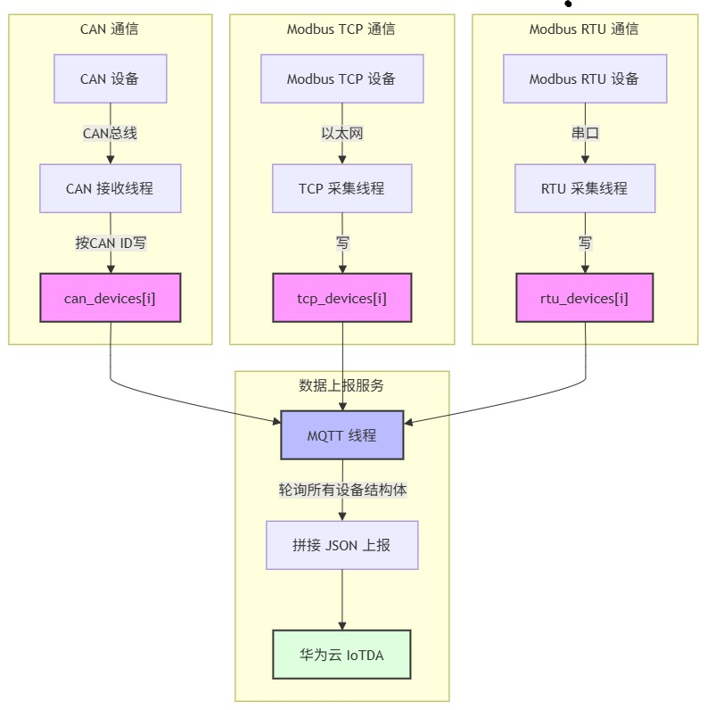

# Linux Gateway - Modbus RTU/TCP/CAN to MQTT

## 项目简介

这是一个运行在鲁班猫RV1106（ARM Linux）上的工业物联网网关原型。
支持 Modbus RTU/TCP 和 CAN 三路数据采集，数据统一写入设备结构体的数组里，再由 MQTT 线程统一轮询上报到华为云 IoTDA。项目用多线程架构，实现了指数退避加随机抖动重连、SQLite 持久化缓存、配置热加载、云端下发控制指定设备这些工程化能力。


## 功能特性

- **多协议采集**：Modbus RTU/TCP双协议主站，支持多设备配置驱动接入
- **CAN总线通信**：SocketCAN采集真实CAN设备数据，按CAN ID识别设备来源
- **MQTT上云**：对接华为云IoTDA，QoS 1保证数据可靠上报
- **云端下发控制**：远程启停采集模块、控制继电器开关
- **系统韧性**：指数退避断线重连、SQLite持久化缓存、补传恢复、告警上报
- **工程化**：Makefile、配置文件外置、日志分级

## 架构图


## 启动步骤

1. 加载 CAN 驱动并配置 can0：
   insmod /lib/gs_usb.ko
   ./set_can_bitrate 125000
   ip link set can0 up

2. 配置网络：
   ip addr add 192.168.2.100/24 dev eth0
   ip link set eth0 up
   route add default gw 192.168.2.1
   echo "nameserver 114.114.114.114" > /etc/resolv.conf

3. 启动网关：
   ./gateway

## 效果展示

//截图或视频链接

## 学习与踩坑记录
详见：https://github.com/wobuDAOOOOOOA/zhi-embedded-notes

## 目录结构

``` 
├── docs/                  #一些基础文档
├── src/                   # 源代码
├── include/               # 头文件
├── Makefile
├── README.md
├── test/        # TCP/CAN/MQTT/fork 等基础功能测试(学习用)
└── test_drv/    # BMP280 驱动测试


