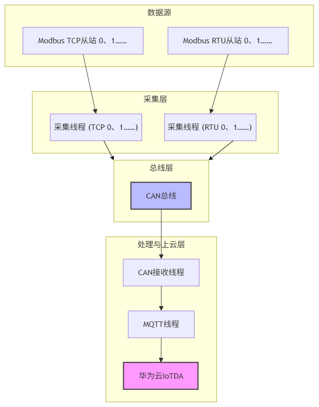

# Linux Gateway - Modbus RTU/TCP to CAN to MQTT

## 项目简介

这是一个运行在鲁班猫RV1106（ARM Linux）上的工业物联网网关原型。
支持 Modbus RTU/TCP 多设备数据采集，内部通过 vcan 总线转发，最终使用 MQTT 协议上报至华为云 IoTDA。
具备多线程架构、断线重连、SQLite 本地缓存补传、配置文件外置、多设备快速接入、云端上报与下发控制等能力。


## 功能特性

- **多协议采集**：Modbus RTU/TCP双协议主站，支持多设备配置驱动接入
- **CAN总线通信**：SocketCAN实现内部数据转发，CAN ID反推设备来源
- **MQTT上云**：对接华为云IoTDA，QoS 1保证数据可靠上报
- **云端下发控制**：远程启停采集模块、控制继电器开关
- **系统韧性**：指数退避断线重连、SQLite持久化缓存、补传恢复、告警上报
- **工程化**：配置文件外置、日志分级、Makefile分离debug/release

## 架构图


## 如何编译与运行
 
1. 安装依赖

```bash

一、libmodbus 交叉编译：

cd /home/XXX
wget https://github.com/stephane/libmodbus/archive/refs/tags/v3.1.10.tar.gz
tar -xzf v3.1.10.tar.gz
cd libmodbus-3.1.10

./autogen.sh
./configure --host=arm-rockchip830-linux-uclibcgnueabihf --prefix=/home/XXX/libmodbus_arm
make
make install
产物：/home/XXX/libmodbus_arm/lib/libmodbus.so.5.1.0


二、libmosquitto 交叉编译:

cd /home/XXX
wget https://github.com/eclipse/mosquitto/archive/refs/tags/v2.0.18.tar.gz
tar -xzf v2.0.18.tar.gz
cd mosquitto-2.0.18

make CC=arm-rockchip830-linux-uclibcgnueabihf-gcc \
     CXX=arm-rockchip830-linux-uclibcgnueabihf-g++ \
     CROSS_COMPILE=arm-rockchip830-linux-uclibcgnueabihf- \
     WITH_TLS=no \
     WITH_CJSON=no \
     WITH_SHARED_LIBRARIES=yes
产物：/home/XXX/mosquitto-2.0.18/lib/libmosquitto.so.1

如果链接报错找不到libmosquitto.so，手动创建符号链接：
cd /home/XXX/mosquitto-2.0.18/lib
ln -sf libmosquitto.so.1 libmosquitto.so


三、can-utils 交叉编译:

cd /home/XXX
git clone https://github.com/linux-can/can-utils.git
cd can-utils
make CC=arm-rockchip830-linux-uclibcgnueabihf-gcc

产物：
/home/XXX/can-utils/candump
/home/XXX/can-utils/cansend
/home/XXX/can-utils/cansniffer


四、SQLite 交叉编译

cd /home/XXX
wget https://www.sqlite.org/2023/sqlite-autoconf-3440200.tar.gz
tar -xzf sqlite-autoconf-3440200.tar.gz
cd sqlite-autoconf-3440200

./configure --host=arm-rockchip830-linux-uclibcgnueabihf --prefix=/home/XXX/sqlite_arm
make
make install

产物：/home/XXX/sqlite_arm/lib/libsqlite3.so

五、安装Modbus rtu/tcp模拟从站  https://github.com/sanny32/OpenModSim

2. 创建VCAN

```bash
ip link add dev vcan0 type vcan
ip link set vcan0 up
ip link show vcan0 
```

### 3. 编译

```bash
# debug 版本（带调试信息）
make debug

# release 版本（优化）
make release
```
> **注意：从站需要在另一个终端中运行，保持它持续运行，不要关闭。**
### 5. 启动 Modbus TCP 从站
```bash
cd modbus_tcp_slave
chmod +x start.sh   # 首次执行需添加执行权限
./start.sh
```
### 6. 启动 
```bash
sudo ./gateway_debug
```

## 效果展示

//截图或视频链接

## 踩过的坑
如果碰到搞不懂的问题可以去我的日志仓库找里面我碰到的所有问题和知识都在里面:
> https://github.com/wobuDAOOOOOOA/zhi-embedded-notes

- **CAN 自收发收不到**：需设置 `CAN_RAW_RECV_OWN_MSGS` 内核选项
- **虚拟从站软件的从站寄存器数量** 需要大于等于配置表里面的conut值，不然不然抓包就会发现通了但是就通了一小下
- **心跳时间要设置到30~120秒之间** 不然你用wireshark抓包发现的是Return Code: Connection Refused: identifier rejected (2) 让你以为是client id有问题，用mosquitto_pub明明是可以的。
- **要用vcan的时候打开内核配置界面的时候一定要用板子手册上的命令** 不然就会出现改了但是没改成或者是不兼容oops等问题


## 目录结构

``` 
├── docs/                  #一些基础文档
├── src/                   # 源代码
├── include/               # 头文件
├── modbus_tcp_slave/      #tcp虚拟从站  ps现在不用这玩意了，用开源软件open Modsim 2 
├── Makefile
├── README.md
├── test/        #mqtt连接华为云测试 can测试 tcp服务端和客户端测试（学习用） frok测试（学习用）
└── test_drv/      #bmp280驱动测试

## 下一步计划

- 
- 
- 
```

